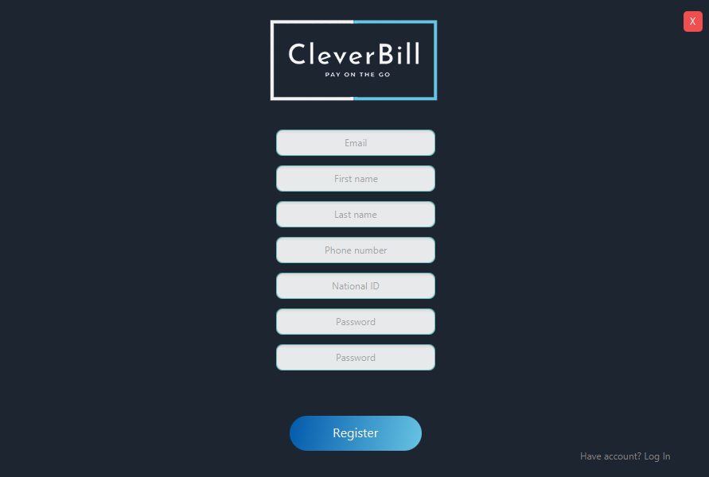
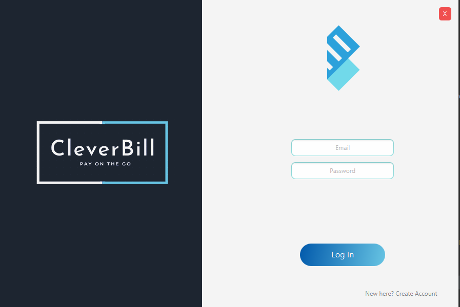
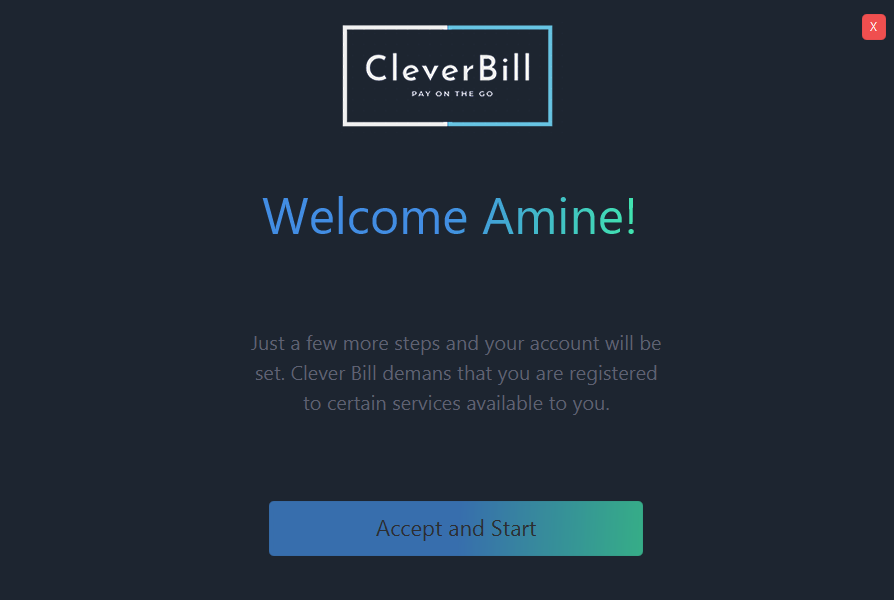

# Billing_System

A java desktop application intended for solving billing services and payments. It uses:

- Java SQL connector to access a SQL database and query its data.

- JavaFX library for designing a modern desktop UI

- Socket/Server connection to retrieve hosted API Data

  

  
